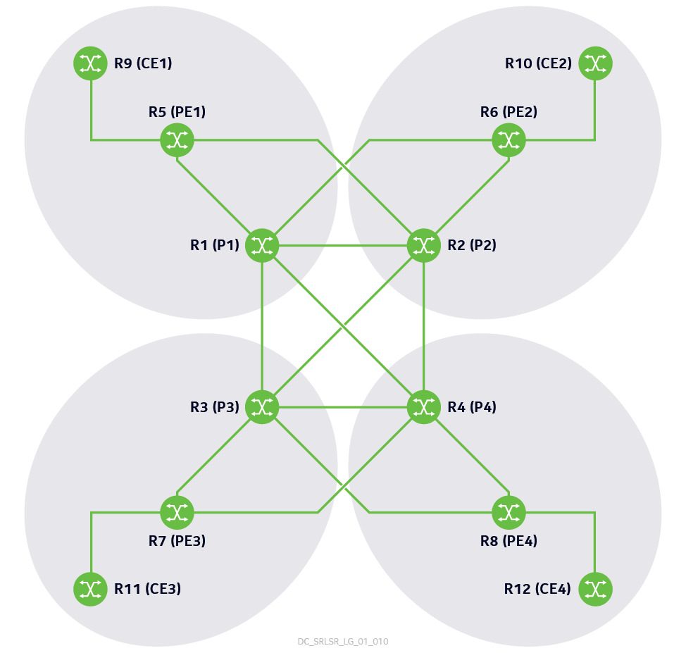

# 🌐 APNIC62 WAN Lab

> **Hands-on Nokia SR Linux Segment Routing & EVPN Workshop**

Welcome to the APNIC62 WAN Lab! This workshop provides **five lab guides** covering IS-IS segment routing, SR-MPLS traffic engineering, and EVPN-MPLS services on a unified 12-router WAN topology.

The labs and exercises below mirror *Nokia SR Linux Segment Routing and EVPN for WAN – APNIC62 Workshop Lab Guide* one-for-one.

> **Note:** This workshop uses **SR-ISIS** as the sole MPLS transport. LDP is not used.

---

## 📚 Workshop Structure

### 🔧 [Lab 1 — Configuration of IS-IS to support Segment Routing and MP-BGP sessions for EVPN](lab1-isis-sr-evpn-bgp.md)

Students will log in to their assigned routers, familiarize themselves with the addressing scheme being used in the lab, and proceed to configure IS-IS to support segment routing. Lastly, students will modify the existing IP virtual routing function (VRF) to have it use segment routing transport tunnels.

| # | Exercise |
|---|----------|
| 1.1 | Familiarization with the lab setup |
| 1.2 | Configure MPLS label blocks for segment routing |
| 1.3 | Configure IS-IS to support segment routing |
| 1.4 | Configure MP-BGP for EVPN as the PE-to-PE protocol |
| 1.5 | Modify an EVPN-MPLS IP-VRF to use IS-IS segment routing transport tunnels |

**Student routers:** R1-P1, R5-PE1, R9-CE1 · **Duration:** ~120 minutes

---

### 📡 [Lab 2 — Configuration and advertisement of traffic engineering link attributes](lab2-te-link-attributes.md)

The student will configure traffic engineering link attributes, such as admin groups and shared-risk link groups (SRLGs), associate the attributes with the different interfaces, and configure the routing protocol to advertise the additional link information.

| # | Exercise |
|---|----------|
| 2.1 | Configure traffic engineering link attributes |
| 2.2 | Add interfaces to the traffic engineering contexts |
| 2.3 | Enable IS-IS to advertise traffic engineering information |

**Student routers:** R1-P1, R5-PE1, R9-CE1 · **Duration:** ~45 minutes

---

### 🛤️ [Lab 3 — Configuration of segment routing tunnels with traffic engineering (uncolored SR-MPLS TE policy)](lab3-sr-te-policies.md)

Students will create segment routing tunnels, also known as label switched paths, that satisfy traffic engineering constraints, then modify the existing IP-VRF to have it use SR-TE transport tunnels.

| # | Exercise |
|---|----------|
| 3.1 | Configure an uncolored SR-MPLS TE policy that uses IGP metrics |
| 3.2 | Configure a dedicated MPLS label range for the binding SID (BSID) |
| 3.3 | Configure an uncolored SR-MPLS TE policy that uses explicit paths |
| 3.4 | Modify the TE policy to use TE metrics |
| 3.5 | Verify label stack reduction for a TE policy |
| 3.6 | Configure a TE policy with excluded hops |
| 3.7 | Configure a TE policy with seamless BFD |
| 3.8 | Configure a TE policy with a secondary path for redundancy, ensuring path diversity through SRLGs |
| 3.9 | Modify the IP-VRF to use TE policy transport tunnels |

**Student routers:** R1-P1, R5-PE1, R9-CE1 · **Duration:** ~180 minutes

---

### 🔀 [Lab 4 — Configuration of EVPN ELAN](lab4-evpn-elan.md)

Configure a Layer 2 EVPN ELAN on the PE routers. BGP-EVPN is used in the control plane, and MPLS is used for data encapsulation. The student focuses on PE1; all other PEs and CEs are preconfigured unless otherwise specified.

| # | Exercise |
|---|----------|
| 4.1 | Configure CE1 Interface |
| 4.2 | Configure EVPN-MPLS MAC-VRF |
| 4.3 | Enable proxy-ARP for MAC-VRF |

**Student routers:** R5-PE1, R9-CE1 · **Duration:** ~90 minutes

---

### 🔗 [Lab 5 — Configuration of EVPN multi-homing in ELAN](lab5-evpn-multihoming.md)

Configure and verify EVPN multi-homing for an ELAN. The student focuses on PE1, PE3 and CE1; all other PEs and CE2 are preconfigured.

| # | Exercise |
|---|----------|
| 5.1 | Configure LAG on Access CE |
| 5.2 | Configure MAC-VRF on PE1 |
| 5.3 | Configure an all-active Ethernet Segment and associate LAG with MAC-VRF |
| 5.4 | Explore EVPN routes used for multi-homing |
| 5.5 | Verify default DF election algorithm |
| 5.6 | Configure the preference-based DF election algorithm |
| 5.7 | Verify the MAC routes in multi-homing |
| 5.8 | Configure ECMP to enable aliasing |
| 5.9 | Examine ES failure and redundancy |
| 5.10 | Configure the Ethernet segment for single-active mode |

**Student routers:** R5-PE1, R7-PE3, R9-CE1 · **Observer:** R6-PE2 · **Duration:** ~150 minutes

---

## ✅ Prerequisites

Before starting, ensure you have:

- Linux host (or WSL2) with **Docker** and **[containerlab](https://containerlab.dev/)**
- **Nokia SR Linux license file** at `srl-license/srlinux.license` (provided by workshop organizers)
- SR Linux image: `ghcr.io/nokia/srlinux:26.7`
- **~24–36 GB RAM** and **12+ vCPUs** for 12× IXR-X1B nodes
- Basic understanding of IS-IS, BGP, MPLS, and EVPN concepts

---

## 📋 Preliminary instructions

**1. Lab routers**

Load the start configuration of each lab via the deployment script before working on it. After loading the configuration, the student usually manages three routers — **R1-P1**, **R5-PE1** and **R9-CE1**; the other routers are preconfigured. Each lab has its own start configuration, applied by `./scripts/deploy-lab.sh <N>`.

**2. Lab exercises**

- EVPN RT-2 route advertisements are removed when the route is idle for more than **300 seconds**. Repeat the ping in an exercise to refresh the EVPN route entries if needed.
- Some SR Linux CLI outputs in the guide have columns omitted for readability.
- Use `enter candidate` to enter configuration mode, and `commit stay` to validate and apply changes while staying in candidate mode.

---

## 🚀 Getting Started

1. Clone this repository and place your license file:

```bash
git clone https://github.com/thcorre/apnic62-workshop.git
cd apnic62-workshop
# copy srlinux.license to srl-license/srlinux.license
```

2. Deploy Lab 1:

```bash
cd wan-lab
chmod +x scripts/*.sh
./scripts/deploy-lab.sh 1
```

3. Connect to student routers:

```bash
ssh clab-apnic62-wan-lab-r1-p1    # password: NokiaSrl1!
ssh clab-apnic62-wan-lab-r5-pe1
ssh clab-apnic62-wan-lab-r9-ce1
```

4. Follow [Lab 1](lab1-isis-sr-evpn-bgp.md) and continue in order through Lab 5.

> **💡 Tip:** All labs share a single topology file (`apnic62-wan-lab.clab.yml`); each lab just has its own config directory (`configs/lab<N>-start/`). Run `./scripts/deploy-lab.sh <N>` before starting that lab, or `./scripts/deploy-lab.sh <N> --reload` to push updated configs into an already-running lab without redeploying.

---

## 📖 Lab environments

The guide presents these routers through two views.

**Segment routing lab environment** (Labs 1, 2 and 3) — 12 × 7250 IXR routers: four CE, four PE, four P.



*Figure 1 — Segment routing lab topology, from the workshop lab guide.*

**EVPN lab environment** (Labs 4 and 5) — six of the same routers. PE1–PE4 are R5–R8 and keep their segment routing `system0.0` addresses:

| Lab guide name | Router | Loopback |
|----------------|--------|----------|
| PE1 | R5-PE1 | 10.10.10.5/32 |
| PE2 | R6-PE2 | 10.10.10.6/32 |
| PE3 | R7-PE3 | 10.10.10.7/32 |
| PE4 | R8-PE4 | 10.10.10.8/32 |
| CE1 | R9-CE1 | — |
| CE2 | R10-CE2 | — |

- **Underlay:** IS-IS L2, SR-ISIS MPLS transport
- **Overlay:** MP-BGP EVPN (AS 65530) among PE routers
- **Details:** [Topology and addressing](../docs/topology.md) | [Lab guide router mapping](../docs/router-naming.md)

---

## 🔄 Reset / Redeploy

```bash
cd wan-lab
./scripts/deploy-lab.sh <lab-number>            # full destroy + deploy
./scripts/deploy-lab.sh <lab-number> --reload   # push updated configs without redeploying
# or manually:
clab destroy -t apnic62-wan-lab.clab.yml --cleanup
clab deploy -t apnic62-wan-lab.clab.yml --reconfigure
```

---

## 🛠️ Additional Resources

- [SR Linux Documentation](https://documentation.nokia.com/srlinux/)
- [Learn SR Linux](https://learn.srlinux.dev/)
- [Containerlab SR Linux kind](https://containerlab.dev/manual/kinds/srl/)

---

## 🤝 Getting Help

1. Check the **Troubleshooting** section in each lab guide
2. Verify your license file and containerlab deployment (`clab inspect`)
3. Run `./scripts/verify-lab.sh <N>` for a quick smoke check
4. If deploy fails, run `./scripts/collect-deploy-diagnostics.sh <N>` and check `docker logs clab-apnic62-wan-lab-r1-p1`
5. Ask your lab instructor

---

**Ready to begin?** 🎯 Head to [Lab 1 — Configuration of IS-IS to support Segment Routing and MP-BGP sessions for EVPN](lab1-isis-sr-evpn-bgp.md)
